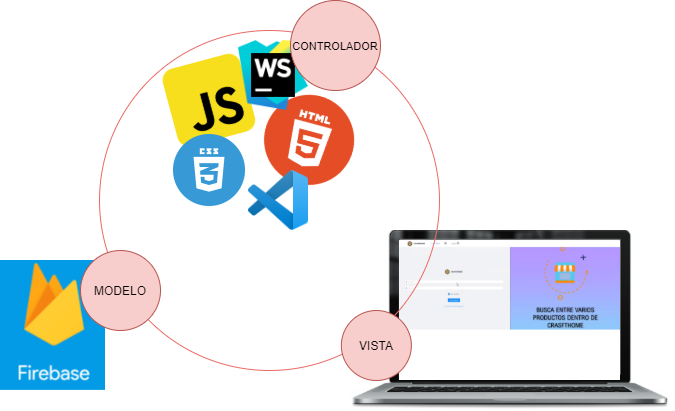
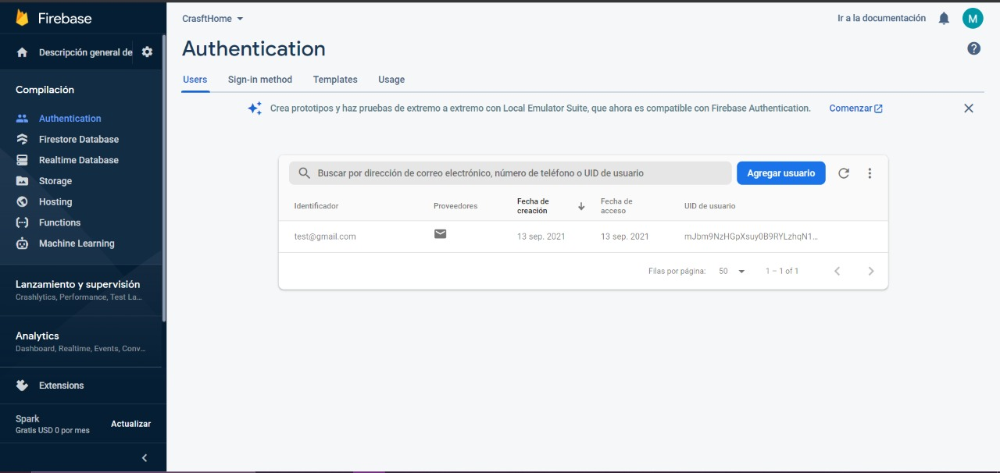
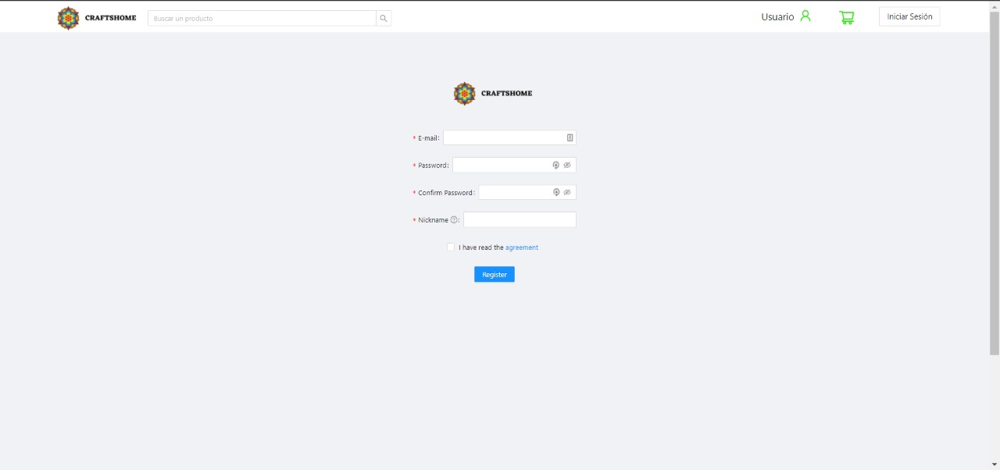
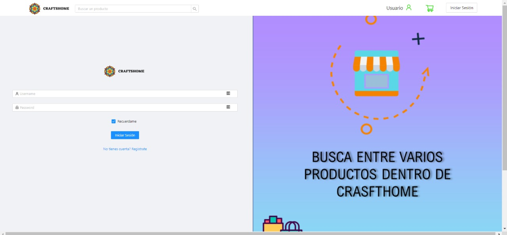
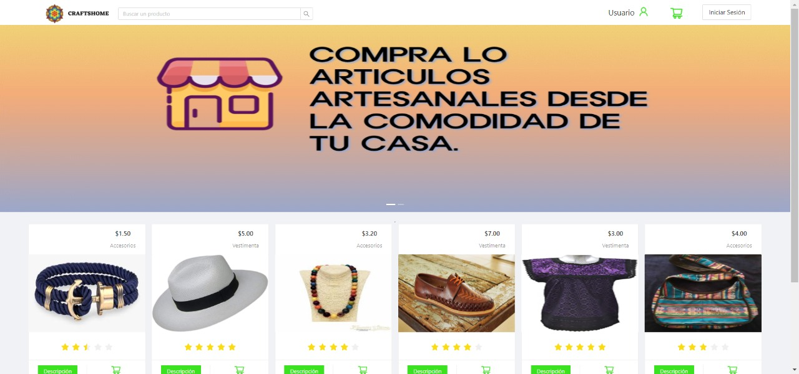
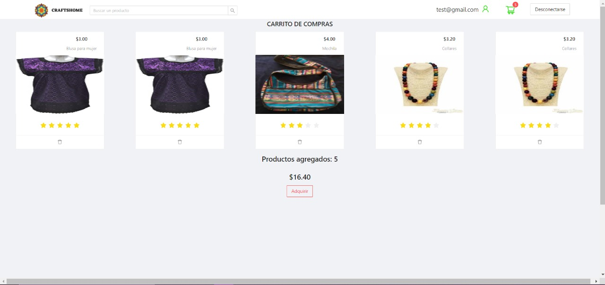
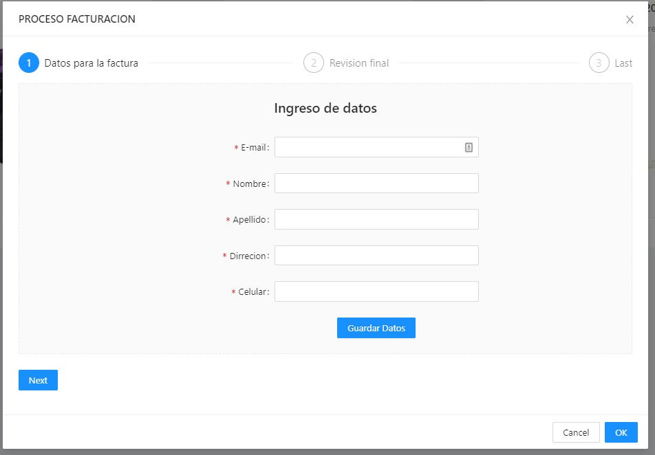
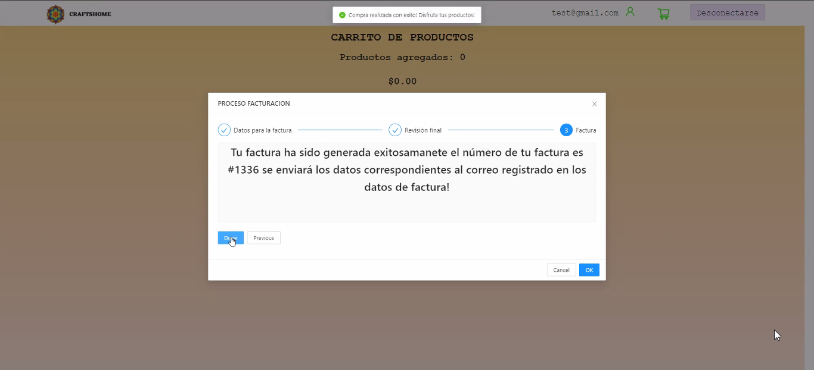

# Proyecto CraftsHome
  El siguiente proyecto muestra el desarrollo de un sistema web que permite la compra y venta de    productos artesanales usando la metodolgia de una tienda en linea. 
  
   **Video demostrativo:** 
   
   **Realizado por:**
   
    -Mateo Vera
    -Kevin Veliz
    -Lizbeth García
    -Kevin Pulupa
    -John Vásconez
    
# 1. Herramientas de Desarrollo
  **WEBSTORM**
      
  Entorno de desarrollo integrado que admite javascript, el lenguaje que usa el sistema ‘CraftsHome’. Esta herramienta facilita la detección de errores para evitar falencias en el código. 
 
 **VSCODE**
  
  Editor de código adicional a la herramienta de WebStorm, se usa por ser gratuito y gestiona extensiones personalizadas, facilita la escritura de código por su autocompletado y admite múltiples lenguajes de programación.
  
  **FIREBASE**
  
  La herramienta proporciona bases de datos en tiempo real que se almacenan en la nube y usan el formato json. La facilidad que brinda esta herramienta es el alojamiento y disposición de la información de forma fácil y se actualiza de inmediato sin necesidad de manipulación manual. Para nuestro sistema web toma la función de autentificador para un inicio de sesión o registro, mediante notificaciones al correo electrónico de los usuarios registrados.
  
 # 2. Estructura y arquitectura
 
 **Arquitectura**
 
 La arquitectura del sistema web se muestra en la siguiente imagen.
 
 
 **Estructura**
 
 
 Los datos que se registran en Firebase toman la siguiente estructura.
 
 
 
 # 3. Funcionalidades principales
 
 
 El sistema web 'CraftsHome' posee las siguientes funcionalidades mas destacadas:
 
 
   **Registro de un usuario a través de un formulario**
     
 El usuario puede realizar su registro en la tienda en linea mediante el uso de su correo electrónico y genera una nueva contraseña para el acceso al sistema 'CraftsHome'. Esta sección es posible por la activacion del metodo de autentificación en Firebase.
 
 
 
     
   **Inicio de sesión**
   
   El usuario nuevo o ya existente puede ingresar a la pagina principal y visualizar los productos que estan siendo ofertados por lo diferentes artesanos.
    
 
    
   **Visualización de un catálogo de productos**

En caso de que al usuario tenga interes en algun producto en especial, el puede acceder a un despliegue de las características del producto seleccionado o a su vez puede visualizar mas productos segun el local de su elección.

 
    
   **Realizar un pedido de un producto**
    
Cuando el cliente se decide por la compra de uno o varios productos, estos se almacenan en un carrito de compras y ahí existe la opcion de 'Comprar'.

 
 
 En este momento incia la compra y el sistema genera una factura con los datos que ingrese el cliente.
 
 
    
   **Factura electrónica de la compra**
 
Una vez finaliza la compra, el sistema envia la factura al correo electrónico registrado.

 
 # 4. Versiones de desarrollo
 
 # 5. Instalación
 
  **1. Clonar el repositorio**
  
  >git clone https://github.com/Chriss78Vera/ProyectoCrasftHome.git
  
  >cd ProyectoCrasftHome 
  
  **2. Instalar dependencias**
  
  >npm install 
  
  
  **3. Levantar el Servidor**
  
  >npm start
 
 # 6. Anexos
 
 
 En el siguiente enlace se halla la documentacion tales como:
 
 
 Manual Técnico
 Manual de Instalación
 Informe Técnico
 >Enlace: https://github.com/Chriss78Vera/ProyectoCrasftHome/tree/main/Documentacion 
    

